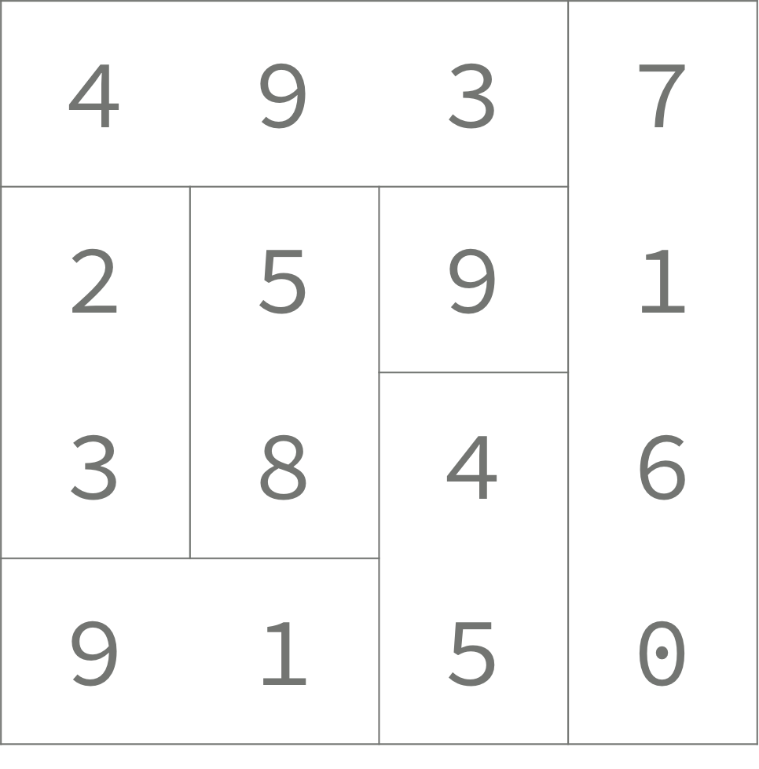

### 백준 14391번: 종이조각


#### 문제 설명
<details markdown="1">
<summary>접기/펼치기</summary>
영선이는 숫자가 쓰여 있는 직사각형 종이를 가지고 있다. 종이는 1×1 크기의 정사각형 칸으로 나누어져 있고, 숫자는 각 칸에 하나씩 쓰여 있다. 행은 위에서부터 아래까지 번호가 매겨져 있고, 열은 왼쪽부터 오른쪽까지 번호가 매겨져 있다.

영선이는 직사각형을 겹치지 않는 조각으로 자르려고 한다. 각 조각은 크기가 세로나 가로 크기가 1인 직사각형 모양이다. 길이가 N인 조각은 N자리 수로 나타낼 수 있다. 가로 조각은 왼쪽부터 오른쪽까지 수를 이어 붙인 것이고, 세로 조각은 위에서부터 아래까지 수를 이어붙인 것이다.

아래 그림은 4×4 크기의 종이를 자른 한 가지 방법이다.   



각 조각의 합은 493 + 7160 + 23 + 58 + 9 + 45 + 91 = 7879 이다.

종이를 적절히 잘라서 조각의 합을 최대로 하는 프로그램을 작성하시오.

 </details>

#### 입력
<details markdown="1">
첫째 줄에 종이 조각의 세로 크기 N과 가로 크기 M이 주어진다. (1 ≤ N, M ≤ 4)

둘째 줄부터 종이 조각이 주어진다. 각 칸에 쓰여 있는 숫자는 0부터 9까지 중 하나이다.
 </details>

#### 출력
<details markdown="1">
<summary>접기/펼치기</summary>
영선이가 얻을 수 있는 점수의 최댓값을 출력한다.
</details>

#### 예시   
<details markdown="1">
<summary>접기/펼치기</summary>

```js
입력
2 3
123
312
```
```js
출력
435
```

</details>

#### 접근   
일반적으로는 비트마스크를 사용해서 푸는 문제다. 하지만 우리느 JS는 기본적으로 number의 자료형이 64비트 부동소수점 숫자형이기때문에 비트연산을 하게 되면 이걸 정수형으로 변환후 비트연산을 하고 다시 돌려주기때문에 겁나느리다. 오히려 boolean 연산보다 느리다!

따라서, 나는 그냥 boolean배열을 사용해서 풀기로 했다.   
기본적인 풀이는 다음과 같다.   
종이조각은 1x1의 크기부터 최대 4x4의 크기를 가지는데 원하는 모양으로 잘라서 숫자를 이은다음 숫자들의 합을 구하는 것이다.   
종이를 가로로 잘라야할지, 세로로 잘라야할지 같은 고민은 안해도된다.   
무조건 한 방향으로만 정하고 그에 따른 모든 경우의 수를 구하면 가로로 자른 경우와 세로로 자른 경우 2가지가 알아서 나오게된다.   

결국, [n과m(2)](../1-15650)처럼 모든 수열의 경우의 수를 구하되, 이것이 NxM의 2차원 배열형식으로 바뀐 것 뿐이다.   
다만, n과m같은 문제와는 다르게 NxM에서 true와 false를 정하는 경우가 마지막 n행m열에 도달하는 순간의 경우만 합을 구하면되므로 깊이같은 셋팅이나 반복문은 따로 필요하지않다.   

합을 구하는 함수는 따로 두었는데, NxM의 배열을 가로 기준으로 한 번, 세로 기준으로 한 번 이렇게 총 2번 반복문을 돌려서 각각 서로 가로와 세로에 해당하는 숫자 일 때에만 합을 구하도록했다.   
즉, 한 번은 숫자를 가로로 읽을때만 구한거고 한 번은 세로로 읽을때만 합을 구한 것이다.   

매번 최종 배열이 나올때 마다 합을 구하는 함수를 두어 전역변수 max값을 계속 갱신하였고, 모든 재귀의 경우의 수가 끝난 다음 메인함수에서 max값을 출력해주면 끝이다.


#### 정답 코드
```js
const readline = require('readline');
const rl = readline.createInterface({
  input: process.stdin,
  output: process.stdout
});
let input = [];
let stats = [];
let max = 0;
let check = [[false,false,false,false],[false,false,false,false],[false,false,false,false],[false,false,false,false]];
rl.on('line', function (line) {
  input.push(line);
})
  .on('close', async function () {
  // 답안 작성
  let num_range = input[0].split(' ');
  let n = num_range[0]*1;
  let m = num_range[1]*1;  
  for(let i =1;i<=n;i++){
    stats.push(input[i].split('').map(el => el*1));
  }  
  re_square(n,m,0,0);
  console.log(max);
  process.exit();
});

let re_square = function(n,m,i,j){    
  if(j<m&&i<n){   
    check[i][j] = true;
    re_square(n,m,i,j+1);
    check[i][j] = false;
    re_square(n,m,i,j+1);
  }else if(i<n-1){    
    check[i+1][0] = true;
    re_square(n,m,i+1,1);
    check[i+1][0] = false;
    re_square(n,m,i+1,1);
  }else{    
    max = Math.max(max, sum_puzzle(n,m));
  }
}

let sum_puzzle = function(n,m){
  let sum_v =0,sum_h=0;
  let tmp_v ='',tmp_h='';
  for(let i=0;i<n;i++){
    for(let j=0;j<=m;j++){
      if(j<m&&!check[i][j]){
        sum_v += tmp_v*1;
        tmp_v = '';
      }else if(j<m&&check[i][j]){
        tmp_v = tmp_v + stats[i][j];
      }else{
        sum_v += tmp_v*1;
        tmp_v = '';
      }
    }
  }
  for(let j=0;j<m;j++){
    for(let i=0;i<=n;i++){
      if(i<n&&check[i][j]){
        sum_h += tmp_h*1;
        tmp_h = '';
      }else if(i<n&&!check[i][j]){
        tmp_h = tmp_h + stats[i][j];
      }else{
        sum_h += tmp_h*1;
        tmp_h = '';
      }
    }
  }
  return sum_v+sum_h;
}
```