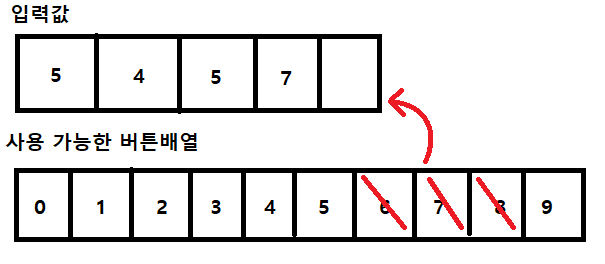
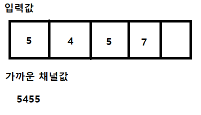

### 백준 1107번: 리모컨

### 문제 설명 
수빈이는 TV를 보고 있다. 수빈이는 채널을 돌리려고 했지만, 버튼을 너무 세게 누르는 바람에, 일부 숫자 버튼이 고장났다.

리모컨에는 버튼이 0부터 9까지 숫자, +와 -가 있다. +를 누르면 현재 보고있는 채널에서 +1된 채널로 이동하고, -를 누르면 -1된 채널로 이동한다. 채널 0에서 -를 누른 경우에는 채널이 변하지 않고, 채널은 무한대 만큼 있다.

수빈이가 지금 이동하려고 하는 채널은 N이다. 어떤 버튼이 고장났는지 주어졌을 때, 채널 N으로 이동하기 위해서 버튼을 최소 몇 번 눌러야하는지 구하는 프로그램을 작성하시오. 

수빈이가 지금 보고 있는 채널은 100번이다.

#### 입력
첫째 줄에 수빈이가 이동하려고 하는 채널 N (0 ≤ N ≤ 500,000)이 주어진다.  둘째 줄에는 고장난 버튼의 개수 M (0 ≤ M ≤ 10)이 주어진다. 고장난 버튼이 있는 경우에는 셋째 줄에는 고장난 버튼이 주어지며, 같은 버튼이 여러 번 주어지는 경우는 없다.

#### 출력
첫째 줄에 채널 N으로 이동하기 위해 버튼을 최소 몇 번 눌러야 하는지를 출력한다.
### 접근   
이번 문제는 좀 오랬동안 붙들고 있었다. 한~두시간정도?   
이유는 처음에 너무 이상한 접근을 시도했다...ㅎㅎ..   

먼저 문제는 주어진 채널 N에 대하여 현재 채널 100에서 +,-버튼으로 이동하는 횟수가 적을지, 아니면 주어진 버튼을 누른뒤 +,-버튼을 마저 눌러서 이동하는 횟수가 적을지 비교하는 문제다.   
   

맨 처음에는 주어진 N에 대하여 0부터 9까지 모든 버튼에 대한 배열을 가지고 시작한다.   
그 뒤 주어진 고장난 버튼 배열을 대입해서 일치하는 배열은 없애는 식으로 남겨진 버튼 배열을 만든다.   
   

그 뒤에 주어진 N을 String형태로 바꾸어 배열화 시킨 뒤, 각 자릿수와 남겨진 버튼중 절대값 차이가 제일 적은 숫자를 골라서 이동할 채널을 고른다.   
```js
return min(N-100, N-5455+버튼누른 횟수)
```   
그 이후 채널을 이동해서 N까지 가는 횟수와 그냥 100부터 N까지 가는 횟수 중 작은 값을 반환한다...   
가 기존의 내 생각이였다.   

그런데 이 설계는 치명적인 문제가 너무나도 많았다.. :joy:   
간단하게 9999의 경우만 해도 그렇다.   
만약 버튼 중 9가 고장나 있으면 현재의 알고리즘은 8888을 출력할것인데, 그냥 10000을 고르면 1번만에 9999로 갈 수 있는데 내 알고리즘은 그러지 못했다.   
그리고 생각해보니깐, brute force문제인데 brute force답지 못한 방법이였다.   

그래서 이번엔 색적 범위를 고르기로 했다.   

0부터 500,000까지 다 돌릴 수 는 없고, 위에서 만든 알고리즘을 이용해서 N자리 수보다 N-1자리의 수가 더 좋을 경우와 N자리 수보다 N+1자리의 수가 더 클 경우를 고려해서 위의 알고리즘으로 구한 임시값보다 1자리수 높은 값과 1자리수 낮은값을 각각 반복문의 시작과 끝의 범위로 잡는다.   
~~**생각해보니 그냥 입력값의 length -1과 +1을 하면 되는거 아닌가?**~~ 라는 생각을 했으나, 그렇게 하면 실패하는 경우가 생긴다.   
해당 번호로 리모컨을 누를수 있는지 없는지를 모르는 상태에서 범위를 일정한 숫자로 잡아버리면 놓치는 경우가 생겨서 최소값이 틀리게 나올 때가 있는 것 같다.   

다시 알고리즘으로 돌아가서 지정한 색적 범위만큼 반복문을 돌리면서 버튼 비교함수(compare_button)에 현재 i행과 고장난 버튼 리스트를 넣어서 현재 i행을 누를수 있는지 검사한다.   
버튼 비교함수는 boolean형식의 반환을 하게되는데, 만약 참이면 현재i행값과 입력값과의 절대값 차이와 기존의 min값을 비교하여 새로운 min값을 저장한다.   

이 반복문이 끝나면 최종적으로 그냥 +,-버튼으로 100번부터 입력채널까지 올라간 횟수와 비교하여 최종값을 출력 해 준다.

**ps**   
끝나고 다른 사람 코드를 봤는데 그냥 1부터 1,000,000까지던가? 기존의 리미트값을 초과해서 돌리셨더라... 그냥 색적범위고 뭐고 진짜 무식하게 처음부터 끝까지 돌리면서 버튼만 있는지 비교해도 되는 것 같다.. :sob:


#### 정답 코드
```js
const readline = require('readline');
const rl = readline.createInterface({
  input: process.stdin,
  output: process.stdout
});
let input = [];
rl.on('line', function (line) {
  input.push(line)
})
  .on('close', async function () {
  // 답안 작성
  let answer ='';
  let n = input[0].split('');
  if(input[2]){
    let arr = input[2].split(' ');  
    answer = remotecon(n,arr);
  }else{
    answer = remotecon(n);
  }    
  console.log(answer)
  process.exit();
});

let remotecon = function(n, arr=[]){
  let button = ['0', '1', '2', '3', '4', '5', '6', '7', '8', '9'];
  let diff = [];
  let diff_max = [];
  let result = Math.abs(n.join('')*1-100);
  //고장난 버튼 찾기
  arr.reduce((acc,cur)=>{    
    button.splice(button.indexOf(cur),1);
  },'')    
  //최대,최소 범위 지정  
  if(button.length>0){
    for(let i = 0 ; i<n.length;i++){
      let min_btn = button.reduce((acc,cur)=>{
        if ((acc-n[i]*1) != Math.min((acc-n[i]*1),(cur*1-n[i]*1)))acc=cur;
        return acc
      });
      diff.push(min_btn)
      let max_btn = button.reduce((acc,cur)=>{
        if ((acc-n[i]*1) != Math.max((acc-n[i]*1),(cur*1-n[i]*1)))acc=cur;
        return acc
      });
      diff_max.push(max_btn)
    }
  }  
  if(diff.length>1)diff.pop();
  diff_max[0] = 1+diff_max[0];

  //범위 내의 모든 경우에서 최소값 찾기
  let min = 500000;
  for(let i=diff.join('')*1;i<=(diff_max.join(''))*1;i++){
    if(compare_button(arr,i)){
      min = Math.min(Math.abs(i*1-n.join('')*1)+ i.toString().length, min);      
    }
  }
  return Math.min(result, min);
}
//고장난 버튼이 있는지 비교
function compare_button(arr, i){  
  i = i.toString().split('');  
  for(let j = 0;j<i.length;j++){
    if(arr.includes(i[j]))return false;
  }  
  return true;
}
```   
