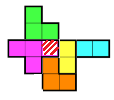

### 백준 14500번: 테트로미노

### 문제 설명 
폴리오미노란 크기가 1×1인 정사각형을 여러 개 이어서 붙인 도형이며, 다음과 같은 조건을 만족해야 한다.

정사각형은 서로 겹치면 안 된다.
도형은 모두 연결되어 있어야 한다.
정사각형의 변끼리 연결되어 있어야 한다. 즉, 꼭짓점과 꼭짓점만 맞닿아 있으면 안 된다.
정사각형 4개를 이어 붙인 폴리오미노는 테트로미노라고 하며, 다음과 같은 5가지가 있다.   
   
아름이는 크기가 N×M인 종이 위에 테트로미노 하나를 놓으려고 한다. 종이는 1×1 크기의 칸으로 나누어져 있으며, 각각의 칸에는 정수가 하나 쓰여 있다.

테트로미노 하나를 적절히 놓아서 테트로미노가 놓인 칸에 쓰여 있는 수들의 합을 최대로 하는 프로그램을 작성하시오.

테트로미노는 반드시 한 정사각형이 정확히 하나의 칸을 포함하도록 놓아야 하며, 회전이나 대칭을 시켜도 된다.

#### 입력
첫째 줄에 종이의 세로 크기 N과 가로 크기 M이 주어진다. (4 ≤ N, M ≤ 500)

둘째 줄부터 N개의 줄에 종이에 쓰여 있는 수가 주어진다. i번째 줄의 j번째 수는 위에서부터 i번째 칸, 왼쪽에서부터 j번째 칸에 쓰여 있는 수이다. 입력으로 주어지는 수는 1,000을 넘지 않는 자연수이다.

#### 출력
첫째 줄에 테트로미노가 놓인 칸에 쓰인 수들의 합의 최댓값을 출력한다.

#### 예제   
```
입력
5 5
1 2 3 4 5
5 4 3 2 1
2 3 4 5 6
6 5 4 3 2
1 2 1 2 1
```
``` 
출력
19
```   


#### 접근   
정사각형 4개를 이어붙인 도형은 테트로미노라고 한다. 그런 테트로미노를 NxM의 종이 위에 놓아서 얻을 수 있는 최대 숫자합을 구해라...인데, 바로 위에 적어놓은 예제를 보자.   
바로 19가 어딘지 알 수 있나? 나는 바로 못 찾았다. 18들만 찾다가 한 3~4번끝에 19를 발견했다.   
그말인즉슨, 규칙으로 찾는게 아니라는 것이다. brute force로 무식하게 풀어내면 된다.   
그러면 주어진 5개의 테트로미노의 모든 경우의 수는19가지다.   
   
이런식으로 하나의 칸을 기준으로 19가지의 경우를 조사해야한다는 것이다.   
물론 저렇게하면 좌우로 칸이 많이 낭비가 되는 것 같아서 최대한 오른쪽과 하단쪽으로 향하도록 하려고 했다.   
그래놓고 짜고보니깐 좌로 1칸 우로 3칸 위로 1칸 아래로 3칸이나 더 썼다...^^;   
이런 코드의 경우에 복잡해지는 경우가 어느 테트로미노를 현재 i,j 칸에 적용할 경우에 왼쪽, 혹은 위쪽 어느쪽이 주어진 배열의 경계인경우?~ 에 추가적인 로직을 짜려고 복잡해지는 경우가 더러있다.   
하지만 이 문제는 brute force, 배열 1~3줄 더 추가된다고 문제안된다.   
넘어갈것같은 엣지부분은 그냥 0으로 채워넣어서 max계산에 있어 영향이 안가게 하면된다.   
~~설마 1칸,2칸짜리의 합이 테트로미노 합보다 크겠는가~~   
코드도 되게 하드하게 짰을뿐, 로직은 심플하다. 반복문2개와 max비교함수 1개가 전부다.   


#### 정답 코드
```js
const readline = require('readline');
const rl = readline.createInterface({
  input: process.stdin,
  output: process.stdout
});
let input = [];
rl.on('line', function (line) {
  input.push(line)
})
  .on('close', async function () {
  // 답안 작성
  let answer ='';
  answer = tetro(input);
  console.log(answer)
  process.exit();
});


let tetro = function(input){
  let tetromino = [];
  let tmp = input.splice(0,1).join('').split(' ');
  let N = tmp[0]*1;
  let M = tmp[1]*1;
  //위,아래 여백용 알파 배열
  let alpha = new Array(M+4).fill(0);
  tetromino.push(alpha);
  input.reduce((acc,cur) => {
    //좌, 우에도 필요한 만큼 여백을 넣어준다
    tetromino.push(('0 '+cur+' 0 0 0').split(' '));
  },'');  
  tetromino.push(alpha);
  tetromino.push(alpha);
  tetromino.push(alpha);
  return tetro_max(tetromino, N, M);
}

let tetro_max = function(t,N,M){
  let result = 0;
  //console.log(t)
  for(i=1;i<=N;i++){
    for(j=1;j<=M;j++){      
      //현재까지의 max값과 그 외 19가지 테트로미노 경우의 수들 중 MAX를 구한다.
      result = Math.max(result, (t[i][j]*1+t[i+1][j]*1+t[i+2][j]*1+t[i+3][j]*1), (t[i][j]*1+t[i][j+1]*1+t[i][j+2]*1+t[i][j+3]*1), (t[i][j]*1+t[i+1][j]*1+t[i][j+1]*1+t[i+1][j+1]*1),
      (t[i][j]*1+t[i+1][j]*1+t[i+2][j]*1+t[i+2][j+1]*1), (t[i][j]*1+t[i+1][j]*1+t[i][j+1]*1+t[i][j+2]*1), (t[i][j]*1+t[i+1][j]*1+t[i+1][j+1]*1+t[i+1][j+2]*1), (t[i][j]*1+t[i+1][j]*1+t[i+2][j]*1+t[i+2][j-1]*1),
      (t[i][j]*1+t[i][j+1]*1+t[i+1][j+1]*1+t[i+2][j+1]*1), (t[i][j]*1+t[i][j+1]*1+t[i][j+2]*1+t[i-1][j+2]*1), (t[i][j]*1+t[i][j+1]*1+t[i][j+2]*1+t[i+1][j+2]*1), (t[i][j]*1+t[i][j+1]*1+t[i+1][j]*1+t[i+2][j]*1),
      (t[i][j]*1+t[i+1][j]*1+t[i+1][j+1]*1+t[i+2][j+1]*1), (t[i][j]*1+t[i][j+1]*1+t[i-1][j+1]*1+t[i-1][j+2]*1), (t[i][j]*1+t[i+1][j]*1+t[i+1][j-1]*1+t[i+2][j-1]*1), (t[i][j]*1+t[i][j+1]*1+t[i+1][j+1]*1+t[i+1][j+2]*1),
      (t[i][j]*1+t[i][j+1]*1+t[i-1][j+1]*1+t[i][j+2]*1), (t[i][j]*1+t[i+1][j]*1+t[i+1][j+1]*1+t[i+2][j]*1), (t[i][j]*1+t[i][j+1]*1+t[i][j+2]*1+t[i+1][j+1]*1), (t[i][j]*1+t[i+1][j]*1+t[i+1][j-1]*1+t[i+2][j]*1))
    }
  }
  return result;
}
```   
