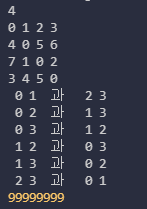
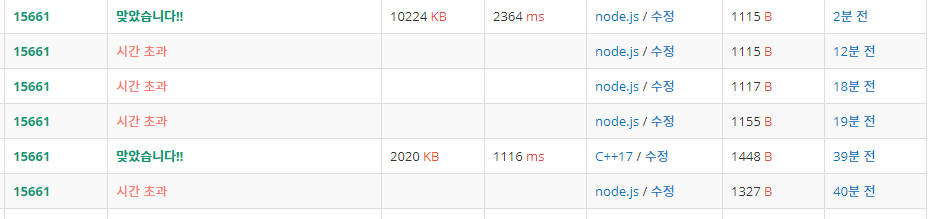

### 백준 15661번: 링크와 스타트


#### 문제 설명
<details markdown="1">
<summary>접기/펼치기</summary>
오늘은 스타트링크에 다니는 사람들이 모여서 축구를 해보려고 한다. 축구는 평일 오후에 하고 의무 참석도 아니다. 축구를 하기 위해 모인 사람은 총 N명이다. 이제 스타트 팀과 링크 팀으로 사람들을 나눠야 한다. 두 팀의 인원수는 같지 않아도 되지만, 한 명 이상이어야 한다.

BOJ를 운영하는 회사 답게 사람에게 번호를 1부터 N까지로 배정했고, 아래와 같은 능력치를 조사했다. 능력치 Sij는 i번 사람과 j번 사람이 같은 팀에 속했을 때, 팀에 더해지는 능력치이다. 팀의 능력치는 팀에 속한 모든 쌍의 능력치 Sij의 합이다. Sij는 Sji와 다를 수도 있으며, i번 사람과 j번 사람이 같은 팀에 속했을 때, 팀에 더해지는 능력치는 Sij와 Sji이다.

N=4이고, S가 아래와 같은 경우를 살펴보자.


|i\j|	1|	2|	3|	4|
|:-:|:-:|:-:|:-:|:-:|
|1|	 |	1|	2	|3|
|2|	4|	 |	5	|6|
|3|	7	|1|	 	|2|
|4|	3|	4|	5	 ||


예를 들어, 1, 2번이 스타트 팀, 3, 4번이 링크 팀에 속한 경우에 두 팀의 능력치는 아래와 같다.

- 스타트 팀: S12 + S21 = 1 + 4 = 5
- 링크 팀: S34 + S43 = 2 + 5 = 7

1, 3번이 스타트 팀, 2, 4번이 링크 팀에 속하면, 두 팀의 능력치는 아래와 같다.

- 스타트 팀: S13 + S31 = 2 + 7 = 9
- 링크 팀: S24 + S42 = 6 + 4 = 10

축구를 재미있게 하기 위해서 스타트 팀의 능력치와 링크 팀의 능력치의 차이를 최소로 하려고 한다. 위의 예제와 같은 경우에는 1, 4번이 스타트 팀, 2, 3번 팀이 링크 팀에 속하면 스타트 팀의 능력치는 6, 링크 팀의 능력치는 6이 되어서 차이가 0이 되고 이 값이 최소이다.

 </details>

#### 입력
<details markdown="1">
<summary>접기/펼치기</summary>
첫째 줄에 N(4 ≤ N ≤ 20)이 주어진다. 둘째 줄부터 N개의 줄에 S가 주어진다. 각 줄은 N개의 수로 이루어져 있고, i번 줄의 j번째 수는 Sij 이다. Sii는 항상 0이고, 나머지 Sij는 1보다 크거나 같고, 100보다 작거나 같은 정수이다.
 </details>

#### 출력
<details markdown="1">
<summary>접기/펼치기</summary>
첫째 줄에 스타트 팀과 링크 팀의 능력치의 차이의 최솟값을 출력한다.
</details>

#### 예시   
<details markdown="1">
<summary>접기/펼치기</summary>

```js
입력
6
0 1 2 3 4 5
1 0 2 3 4 5
1 2 0 3 4 5
1 2 3 0 4 5
1 2 3 4 0 5
1 2 3 4 5 0
```
```js
출력
2
```

</details>

#### 접근   
처음에는 먼저 풀어본 [스타트와 링크](../2-14889)의 단순 응용문제라고 생각했다.   
"스타트와 링크"와의 차이점이라면 스타트와 링크는 무조건 짝수인 N을 반을 나누어 2개의 수열을 구하는 것이었고, 이번 "링크와 스타트"는 N이 홀수일 수 도 있으며 수열도 똑같은 숫자의 수열 2개를 구하는것이 아니게 바뀌었다.   

따라서 나는 기존 재귀함수에서 스타트 팀 한팀만 구하는 재귀 호출이 아니라, i행의 인원을 스타트 팀에 넣었을때와 링크 팀에 넣었을때 2가지로 나누어서 2번 재귀호출했다.   
그리고 깊이를 체크하는 부분에서 각각 팀에 최소 두명 이상 존재하는지 체크해서 조건을 만족할 때 만 두 팀의 차이값을 구하도록 했다.(문제에는 최소 1명이라 했는데 최소 1명이면 시너지가 없으니깐 2명으로 설정했다.)   

그 결과 예시 정답은 맞았는데, 문제는 채점에서 시간초과가 나버렸다.   
그럴 수 밖에 없는 것이, 위에서 나는 **스타트 팀에 넣었을때와 링크 팀에 넣었을때 2가지로 나누어서 2번 재귀호출했다.** 라고 했다.   
그말은 **스타트:[1,2], 링크:[3,4]** 와 **스타트:[3,4], 링크:[1,2]** 순서만 다른 2가지 경우가 나올 수 있다는 뜻이다. 작은 경우면 상관없는데 최대 범위인 N을 적용했을 때, N=20의 시간이 걸리는 것이 아니라 2배인 N=40의 계산을 하게 되는 것이다.   

   

이렇게 0 1 과 2 3인 경우가 있는데 아래서 2 3 과 0 1인 경우가 또 나와버린다!   

그래서 다시  [스타트와 링크](../2-14889)의 코드를 가져와서 쓰게됬는데, 메인부분에서 재귀를 호출 할 때 기존의 최대 깊이를 n/2 만큼 지정해줬던 부분을 반복문을 사용해서 1부터 n/2까지로 변경해 주었다.  

   

그런데도 시간초과가 났다!...   
그래서 c++로 똑같이 짰더니 훨씬 빠르게 잘 통과했다. 역시 JS는 PS에 적합하지 않은 언어인가?   
하지만 여기서 포기하지 않았다.   

먼저, 기존의 코드에서는 따로 start team을 찾은 뒤 반복문을 돌려서 link team을 만든 다음에 또 반복문을 돌려서 둘의 차이값을 구한다.   
=> 이 과정을 전부 없앴다.   
잘 생각해보니 우리는 이미 양 팀을 구할 방법이 있다.   
바로 수열 생성 시 중복체크 방지를 위한 check 배열이다.   
해당 배열의 bool값이 true면 start팀, false면 link 팀이다.   

그리고 합을 계산하는 부분도 줄였다.   
이중 반복문을 뒀는데, i는 0부터 n-1까지, (j가 있으므로 마지막 한 칸을 추가로 비워두는 것이다.)   
j는 i+1부터 n까지로 돌려가면서 check[i]와 check[j]가 둘다 true값이거나 false값일때 각각 능력치 배열의 (i,j)값과 (j,i)값을 더해주었다.   

최종적으로 둘의 합과 min값을 비교해서 min값을 최신으로 갱신한 뒤 마지막에 남은 min값을 출력해 주었더니 아슬하게 통과했다.   
~~같은 알고리즘인데 c++의 2배나 된다.~~   
~~심지어 JS는 splice를 전부 없애고 shift를 썼다!...~~


#### 정답 코드
```js
const readline = require('readline');
const rl = readline.createInterface({
  input: process.stdin,
  output: process.stdout
});
let input = [];
let stats = [];
let min = 987654321;
let check = [];
rl.on('line', function (line) {
  input.push(line);
})
  .on('close', async function () {
  // 답안 작성
  const n = input.shift();
  for(let i =0;i<n;i++){
    stats.push(input[i].split(' ').map(el => el*1));
  }
  check = new Array(n).fill(false);

  for(let i =1;i<=n/2;i++){
    re(0, n, i, 0);    
  } 
  
  console.log(min)
  process.exit();
});

let re = function(cnt,n,m,start){
  if(cnt===m){    
    let a_sum = 0;
    let b_sum = 0;
    for(let i=0; i<n-1; i++){
      for(let j=i+1; j<n; j++){
        if(i!==j){
          if(check[i]&&check[j])a_sum+=stats[i][j]+stats[j][i];
          if(!check[i]&&!check[j])b_sum+=stats[i][j]+stats[j][i];
        }
      }
    }
    min = Math.min(min, Math.abs(a_sum-b_sum));
    return ;
  }
  for(let i=start;i<n;i++){    
    if(!check[i]){      
      check[i] = true;            
      re(cnt+1,n,m,i+1);      
      check[i] = false;
    }
  }
  return ;
}

```
