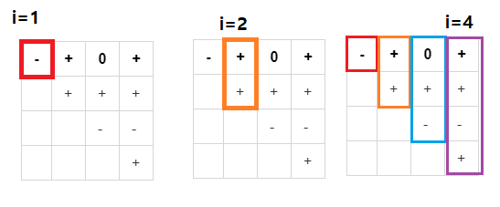

### 백준 1248번: 맞춰봐


#### 문제 설명
<details markdown="1">
<summary>접기/펼치기</summary>
규현이는 멍청하다. 왜냐하면, 1~10까지 수 밖에 모르기 때문이다. 어느 날 규현이 옆을 지나가던 태석이가 규현이를 보고 이렇게 외쳤다. "빵빵!!" 규현이는 "아하!" 하면서 세상에는 빵이란 수도 있구나 했다. 그날 이후로 규현이는 매일 친구들을 볼 때면 "빵빵!!" 거리면서 인사를 했다. 규현이의 친구 중에는 태방이가 있다. 자꾸 규현이가 "빵빵!!" 거릴때 마다 자신을 놀리는 것 처럼 생각했던 태방이는 규현이에게 그건 "빵이 아니고 영이야" 라고 가르쳐 줬다.

이제 규현이는 0~10까지 수를 알고 있다. 어느 날 자신이 알고 있는 숫자를 까먹지 않으려고 종이에 1~10까지 수를 썻다. (0은 잠시 까먹었다) 규현이의 친구 석원이는 밀덕이다. 계급을 엄청나게 좋아해서, 규현이가 써 놓은 숫자에 이등병 마크인 -를 모두 그렸다. 석원이는 규현이에게 이렇게 말했다. "너, 우리 위대하신 미하엘 칼라시니코프께서 뭐라고 했는지 알아? 단순함과 신뢰성, 그리고 저렴한 가격이 최고야!"

규현이는 그 말을 듣고서 아하 세상에는 음수도 있구나 했다.

이제 규현이가 아는 수는 -10부터 10까지 20개가 되었다. 아차, 0을 빼먹었구나, 21개가 되었다.

근처 사파리에 놀러간 규현이는 사파리 가이드 승환이와 함께 관광을 시작했다. "저기, 사자 1마리가 보이죠? 그 옆이 그 사자 부인이에요. 그러니깐, 1 더하기 1은 2죠" 규현이는 덧셈을 익혔다. "저 사자는 아까 그 사자의 자식 2마리 입니다. 그럼 총 사자는 몇 마리이지요?" 이제 규현이는 1+1을 제외한 다른 덧셈도 할 수 있다. 만세!

인도네시아에 놀러간 규현이는 자바 섬에 방문했다. 자바 섬에는 자바 커피를 재배하는 홍태석 농부가 있었다. 홍태석은 "ㅋㅋㅋ 님 음수와 양수와 0의 차이도 모름?" 하면서 음수와 양수와 0을 설명해주었다.

지금까지 배운 것을 종합해서, 한국으로 돌아오는 비행기에서 규현이는 종이에 수를 N개 썼다. (규현이가 아는 가장 큰 수는 10이기 때문에, 수를 10개까지만 쓸 수 있다.)  그 다음에, 가능한 모든 N*(N+1)/2개의 구간의 합을 구했다. 이 것을 해인이는 행렬로 표현했다.

규현이가 쓴 수를 A라고 하면, A[i]는 규현이가 i번째 쓴 수이다. 그리고, S[i][j]는 A[i]부터 A[j]까지 합이 0보다 크면 +, 0이면 0, 0보다 작으면 -이다. 여기서 i는 항상 j보다 작거나 같다. 이렇게 배열을 채우면 배열에는 총 N*(N+1)/2개의 문자가 있다. (+, -, 0 중 하나) 이 S 배열이 주어졌을 때, 규현이가 쓴 N개의 수 A를 구해서 출력하면 된다. 규현이는 -10부터 10까지의 정수밖에 모르기 때문에, A도 -10부터 10까지의 정수로만 이루어져 있어야 한다.

 </details>

#### 입력
<details markdown="1">
첫째 줄에 수열의 크기 N이 주어진다. N은 10보다 작거나 같은 자연수이다. 둘째 줄에는 N(N+1)/2 길이의 문자열이 주어진다. 처음 N개의 문자는 부호 배열의 첫 번째 줄에 해당하고, 다음 N-1개의 문자는 두 번째 줄에 해당한다. 마찬가지로 마지막 문자는 N번째 줄에 해당하는 문자다.
 </details>

#### 출력
<details markdown="1">
<summary>접기/펼치기</summary>
첫째 줄에 수열의 원소 N개를 빈 칸을 사이에 두고 출력한다. 답이 여러 가지 일 경우에는 아무거나 출력하면 된다.
</details>

#### 예시   
<details markdown="1">
<summary>접기/펼치기</summary>

```js
입력
4
-+0++++--+
```
```js
출력
-2 5 -3 1
```

</details>

#### 접근   
문제가 너무 서론이 길어서 무슨말인지 헷갈리는데, 그냥 간단하게 풀이하면 이렇다.   
-10부터 10까지 21개의 숫자가 주어진다.   
그리고 1부터 10까지의 무작위 숫자 N개만큼 숫자를 뽑아서 조합한다.   
모든 조합의 합의 결과는 -,+,0 3가지로 표현되며 규칙은 i부터 j까지의 합을 S[i][j]라고 한다.   
즉, 예시의 경우에는   
```js
4
-+0++++--+
```   
이렇게 들어가있는데, 4개의 숫자의 조합의 합 결과가 저렇게 나온다는 뜻이다.   
j는 i와 같거나 크다라고 문제에서 명시했으므로 위의 기호들의 순서는 이렇게 된다.   
```js
s[1][1],s[1][2],s[1][3],s[1][4],s[2][2] ...  s[3][4], s[4][4]
```   
표로 나타내면 이렇게 된다.   

|-|+|0|+|
|-|-|-|-|
||+|+|+|
|||-|-|
||||+|   

이제 우리는 입력받은 기호문자열을 배열로 만들 수 있다.   
이중 반복문을 돌려서 외부반복문 i는 0부터 N까지, 내부 반복문 j는 i부터 N까지 돌리면서 입력받은 기호문자열을 하나씩 배열에 넣어주면된다.   

그 뒤에 -10 부터 +10까지 21개의 배열을 N번 재귀함수를 돌려서 모든 경우의 수를 만든다음 해당 수열이 위의 기호문자열 배열을 만족하는지 검증하면 된다....   

였는데, 시간초과가 나버렸다.   
무작정 모든 수열을 구하려고하면 21^N + N! 만큼의 시간이 걸리게 된다.   

따라서 이를 줄이려고 나는 sum이라는 매개변수를 재귀함수에 넣어줘서 S[i][i], 즉 단순한 i번째 숫자까지의 합이 위에 입력받은 기호들을 만족하는지로 체크하려고 했다.   
그래봤자 +,-,0 셋 중에 하나이기때문에 크게 시간이 줄어들지는 않았다.   

그래서 아예 현재까지 입력한 숫자가 위의 입력받은 기호의 규칙에 성립하는지 검사하는 함수를 따로 만들었다.   
N번째 숫자까지 입력받고 체크하는 것이 아닌 현재 입력받은 숫자만 검사하는 것이다.   

원리는 이렇다.   
   

숫자를 1번째만 입력하면 우리는 S[1][1] 의 경우만 구하면된다.   
즉 숫자가 음수인지만 체크하면된다.   

숫자가 2개가 입력되면 우리는 1번째의 모든 경우는 확인했으므로, 1번째+2번째와 2번의 경우가 각각 입력된 기호를 만족하는지 체크한다.   

같은 방법으로 N까지 진행하면 된다.   

이런 방법으로 우리는 맨위에 무작정 -10 ~ 10까지의 모든 N개의 숫자의 조합의 경우를 체크하는 것에 비해 2가지 백트래킹 이점을 얻을 수 있다.   
1. 숫자를 N개가 아닌 한 개를 선택 할 때마다 가능하지 여부를 판단 할 수 있다.   
2. 규칙을 체크할때 N! 만큼 검사하는것이 아닌 최대 N의 시간만 걸린다.   

이런 2가지의 이점이 있기 때문에 아래와 같은 방법으로 진행해서 통과했다.   

1. -10 부터 10까지 N개의 숫자를 선택하는 재귀함수를 진행한다.   
1.1 재귀 함수 안에서 현재까지 선택한 숫자 배열이 규칙을 위배하는지 체크한다.
1.2 2차원 배열에서 행 값은 현재까지 선택한 숫자의 갯수, 열 값은 현재 배열의 길이로 고정해서 규칙과 비교한다.
2. 정해놓은 깊이 n에 도달하면 전역 배열에 수열을 넣는다.   
3. 전역 배열의 길이가 1 이상이면 재귀함수의 나머지 과정을 return 해서 끊어준다.   

ps   
그 와중에 기호를 넣어주는 길이 10x10의 배열을 new Array로 만들어주고 싶었는데 JS는 객체를 주소에 의한 참조 복사를 하기 때문에 fill([]) 이런식으로 넣어버리면 모든 객체가 같아지기 때문에 반복문을 사용해서 값으로 직접 넣어주거나 처음부터 노가다로 만들어줘야한다...


#### 정답 코드
```js
const readline = require('readline');
const rl = readline.createInterface({
  input: process.stdin,
  output: process.stdout
});
let input = [];
let stats = [[],[],[],[],[],[],[],[],[],[],[]];
let list = [];
let numbers = [-10, -9, -8, -7, -6, -5, -4, -3, -2, -1, 0, 1, 2, 3, 4, 5, 6, 7, 8, 9, 10]
let answer = [];
let check = [];
rl.on('line', function (line) {
  input.push(line);
})
  .on('close', async function () {
  // 답안 작성
  const n = input.shift()*1;
  let tmp = input[0].split('');  
  check = new Array(22).fill(false);  
  for(let i=0;i<n;i++){
    for(let j=i;j<n;j++){
      stats[i][j] = tmp.shift();      
    }
  }
  re(0, 21, n);
  console.log(answer.join(''));
  process.exit();
});

let check_result = function(array,n){
  
  let result = true;
  let sum = 0;
  let check;
  for(let i=n;i>=0;i--){
    sum += array[i]*1;
    if(sum<0)check='-';
    else if(sum>0)check='+';
    else check='0';
    if(check == stats[i][n])continue;
    else{
      result = false;
      break;
    }
  }
  return result;
}

let re = function(cnt,numbers_length,n){    
  if(cnt===n){            
    answer.push(list.join(' '));    
    return ;
  }
  for(let i=0;i<numbers_length;i++){   
    if(answer.length>0)return;
    list[cnt] = numbers[i];    
    if(check_result(list,cnt)){      
      re(cnt+1,numbers_length,n);
    }
  }
  return ;
}
```
