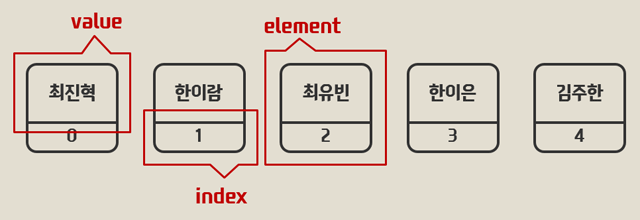
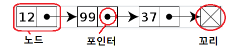

## javascript로 연결 리스트(Linked List) 만들어보기   
   
### 배열과 연결리스트   

javascript에서의 연결 리스트를 말하기 앞서, 연결 리스트란 무엇이고 배열은 무엇인가? 를 가볍게 짚고 넘어갈 필요가 있다.   
먼저 배열은 무엇인가?   

#### 배열
배열은 인덱스를 이용해서 같은 자료형의 데이터를 관리하는 데이터 자료구조다.   
   
[그림 출처](https://opentutorials.org/module/1335/8677)   
위 그림처럼 각 배열은 인덱스 값과 자료 값 2가지의 데이터를 가진 자료들로 이루어진다.   
인덱스 값을 가진 데이터들이 순서대로 늘어선 배열의 형식이고..   
- 논리적 저장순서와 물리적 저장순서가 같고, 인덱스 값만 정확하게 안다면 해당 데이터에 접근하는 시간은 O(1)이다.   
- 제한적인 크기를 갖는다.   
- 삭제 및 삽입시 모든 원소들을 shift해줘야하므로 O(n)의 시간이 걸린다.   

그 외에도 랜덤 접근이 가능하다던지여러가지 특성이 있지만, 이번은 연결 리스트와 비교하기 위해 간단한 설명만 하는 것이므로 자세한 부분은 생략한다.   

그러면 이번엔 연결 리스트를 보자.   

#### 연결 리스트   
연결 리스트는 각 노드가 데이터와 포인터를 가지고 서로 연결되어 있는 방식의 데이터 자료구조다.   
   
이렇게 각 노드는 데이터와 자기 바로 뒤의 포인터 위치만 기억한다.   
강강수월래 할 때 서로 손잡고 이동하듯이 자기 뒤 밖에 모르는 애들이다.
특징으로는   

- 맨 처음부터 원하는 항목까지 순차적으로 접근하므로 접근하는데에 O(n)만큼 걸린다.
- 논리적 저장순서와 다르게 물리적 저장순서도 다르고 위치도 다 다르다.   
- 크기에 제한이 없다.   
- 삭제 및 삽입시 해당 앞뒤 노드의 포인터만 수정하면 되서 O(1)시간 밖에 걸리지 않는다.   

이런 특징들이 있고..   
배열은 주로 탐색을 많이 할 경우, 연결리스트는 삽입 및 삭제를 많이 할 경우 유리하다고 한다.   

이번 포스트에서는 개인적인 BFS공부를 위해서 자바스크립트로 연결 리스트를 구현해보고자 한다.   
먼저 연결리스트 객체를 하나 만들어주자.   
```js
let LinkedList = function(){
  let list = {};  //여기서는 리스트 하나가 각각의 노드의 역할을 한다.  
  list.head = null;
  list.tail = null;

  return list;
}
//LinkedList = {head:null, tail:null};
```   
이게 연결리스트의 기본 형식이다.   
머리와 꼬리의 정보를 갖고있는 리스트 **'전체'**   
이제 여기에 들어갈 각 **노드**를 구현해주자.   
```js
let Node = function(value){
  let node = {};  
  node.value = value;
  node.next = null;

  return node;
}
//Node = {value:value, next:null};
```   
원하는 value값을 넣어주면 value와 자기 다음 포인터를 가지는 객체다.   
포인터에는 기본으로는 null값이 들어간다.   
이제 연결리스트에 그냥 스택처럼 순차적으로 맨뒤에 넣어 줄 수 있는 함수를 추가해준다.   
```js
list.addToTail = function (value){
  let node = new Node(value); 
  if(!this.head){
    this.head = node;
    this.tail = node;
  }else{
    this.tail.next = node;
    this.tail = node
  };
  return node;
};
```   
**if**   

addToTail을 했는데 만약 머리가 없는 경우, this의 (**여기서 this는 new해서 만들어준 LinkedList 객체다.**) head와 tail 둘다 지금 들어온 node로 설정해준다.   
node는 Node함수를 통해 만들어준 value값이 들어간 Node객체다.   
**else**   

만약 연결리스트에 머리랑 꼬리가 존재한다면, this의 꼬리에 위치한 노드의 next 포인터를 현재 넣어주는 node객체로 잡는다.   
그리고 전체 꼬리도 이번에 넣는 node로 변경한다.   
이렇게 add to tail 함수를 완료했다.   

삽입했으니 삭제도 만들어야 하지 않을까   
```js
list.removeHead = function(){
  let removeValue = this.head;
  this.head = this.head.next;
  
  return removeValue.value;
}
```   
그냥 단순하게 머리를 없애는 함수로 만들었다. 일종의 queue 출력과 같은 형태인데, this의 head를 임시 변수에 저장하고 지금 head 노드가 가지고 있는 next포인터의 노드객체를 head로 재할당한다.   
그리고 임시 변수에 저장한 지금의 제거된 head는 반환해준다.   
```js
let linkedlist = new LinkedList();
linkedlist.addToTail(2);
let out = linkedlist.removeHead();
console.loe(out);
//머리부분 출력 "2"
```   
실제 사용하게 되면 이런식으로 머리를 반환하고 연결 리스트에서 머리는 삭제된다.   
연결 리스트는 Heap영역이기 때문에 삭제라기보다는 현재로서는 연결을 끊는다.. 가 맞는 표현일 것 같다.   

마지막으로 원하는 value가 연결리스트에 존재하는지 찾는 함수를 구현해 본다.   
```js
list.contains = function(target){  
  let accNode = this.head;
  while(accNode){    
    if(accNode.value == target){
      return true;
    }else{
      accNode = accNode.next;
    }
  }
  
  return false;
};
```   
먼저 accNode라는 this의 머리를 참조하는 변수를 선언한다.   
accNode의 머리가 존재할 때, 즉, 연결리스트가 존재하는지 부터 체크를 한다.   
만약 현재 머리 노드의 value가 입력받은 target과 일치하면 true를 반환한다.   
아닐경우 accNode의 노드값을 현재 노드의 next포인터의 노드로 변경하고 계속 진행한다.   
끝까지 가서 tail에 해당하는 노드를 만나게 될 경우 next는 기본값인 null값을 가지고 있으므로 while문은 종료된다.   
(이 부분에 대해서는 사실 accNode != tail의 조건을 걸어볼까도 생각했는데, 동일한 조건의 객체가 tail보다 앞서서 나오면 중간에 끊켜버리는것아닌가?... 하는 생각이 들어서 그냥 next로 계속 보내면서 accNode의 존재유무로 반복문을 돌렸다.)   

아무튼 최종적으로 accNode가 null값이 될 때까지 target과 일치하는 값이 없었으면 false를 반환하게 된다.   

이 이후 중간 삽입이라던지 중간 삭제는 전부 위에서 만든 contains와 remove, add함수들을 조금씩 변형하면 되기때문에 나머지는 따로 만들지 않았다.   

나도 처음에 연결리스트를 마주했을때 좀 이해하기 어려운 점이 더러 있었는데, 누군가는 내 글을 보고 연결리스트에 관해서 조금이나마 도움이 되면 좋겠다.   

###### 전체코드   
```js
let LinkedList = function(){
  let list = {};  //여기서는 리스트 하나가 각각의 노드의 역할을 한다.
  //얘네들은 앞뒤가 아님, 전체연결리스트의 제일 앞 머리와 제일 뒤 꼬리만 갖고있는것이다.
  list.head = null;
  list.tail = null;

  list.addToTail = function (value){
    let node = new Node(value);  //들어온 데이터 v를 Node함수를 이용해서 node객체에 넣어놓는다.
    //여기서 this의 head란 무엇일가? list.addTOTail할때 list본인을 말한다.
    if(!this.head){
      //머리가없을때 = 최초생성 일 때
      this.head = node;
      this.tail = node;
    }else{
      this.tail.next = node;
      this.tail = node
    };
    return node;
  };
  list.removeHead = function(){
    //removeValue에 리스트의 머리를 셋팅하고
    let removeValue = this.head;
    //지금 머리는 this.heaa.next, 다음을 가르키게 한다. 건너뛰어서 연결을 해제해버리는것
    this.head = this.head.next;
    return removeValue.value;
  }
  //값이 있는지 찾는 함수
  list.contains = function(target){
    //accNode에 첫번째 머리 장전하시고
    let accNode = this.head;
    while(accNode){
      //target value를 찾을때까지 뒤로뒤로 간다.
      if(accNode.value == target){
        return true;
      }else{
        accNode = accNode.next;
      }
    }
    //다돌았는데 없으면 없는거지, false를 리턴
    return false;
  };  
  return list;
}

let Node = function(value){
  let node = {};
  //value와 다음 노드를 갖고있는 객체
  node.value = value;
  node.next = null;

  return node;
}
```

